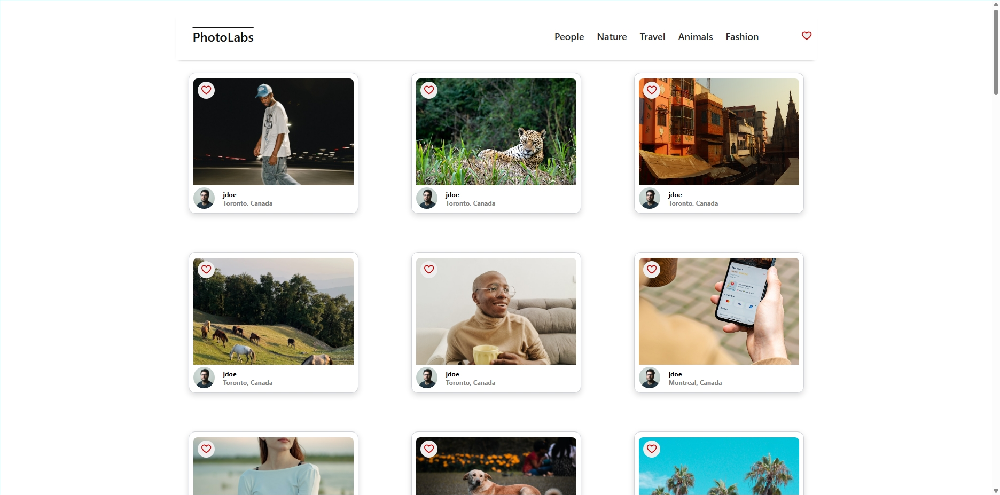
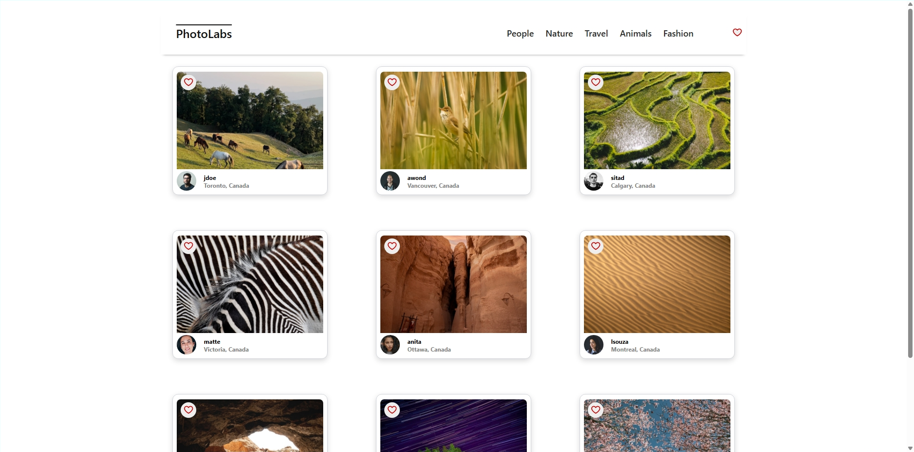
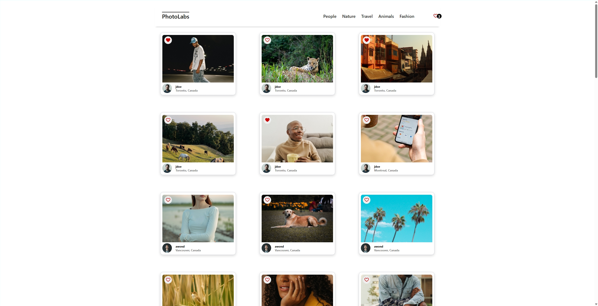
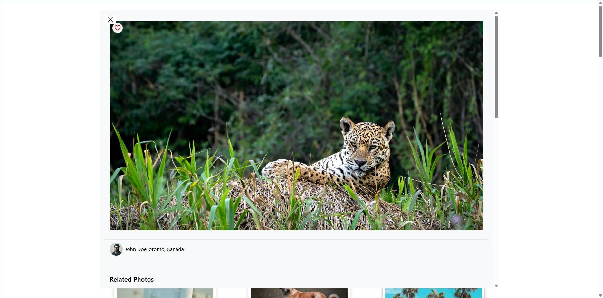

# Photolabs
Photolabs is a modern React-based application designed to provide an engaging way to explore and manage images from dynamic API endpoints. Built with a focus on simplicity and performance, Photolabs integrates a robust Frontend with a dedicated Backend to deliver a seamless visual experience.

The application architecture is divided into two primary sections:

- **Frontend**: Powered by React and bundled using Webpack, the frontend offers an interactive user interface that allows you to view, filter, and preview images in real-time. The design emphasizes usability, ensuring that users can quickly navigate between features like the main gallery, topic filters, favorited collections, and image previews.

- **Backend**: Acting as the engine behind the scenes, the backend is responsible for handling API requests and managing data. It provides the necessary endpoints for retrieving image data allowing the frontend to dynamically load content. Detailed setup instructions are available in the `backend/readme` file to help you get started.

### Key Features

- **Real-Time Data Retrieval**: Leverage API endpoints to load new images and content without manual refresh.
- **Image Filtering**: Easily filter images by topics, making it simpler to find the content of your interest.
- **Favorites Management**: Mark and manage your favorite images with a user-friendly heart icon, ensuring quick access from any part of the app.

## Screenshots

Below are a few screenshots highlighting the core features of PhotoLabs:

### Main Page

*The homepage displays photos loaded from the API.*

### Filtered by Topic

*Clicking on a topic filters the photos by that category.*

### Favorited Images

*Favorited images are indicated by the heart icon and update across the navigation.*

### Preview Images

*Previewing an image by clicking one.*

## Setup

Install dependencies with `npm install` in each respective `/frontend` and `/backend`.

## [Frontend] Running Webpack Development Server

```sh
cd frontend
npm start
```

## [Backend] Running Backend Server

Read `backend/readme` for further setup details.

```sh
cd backend
npm start
```
